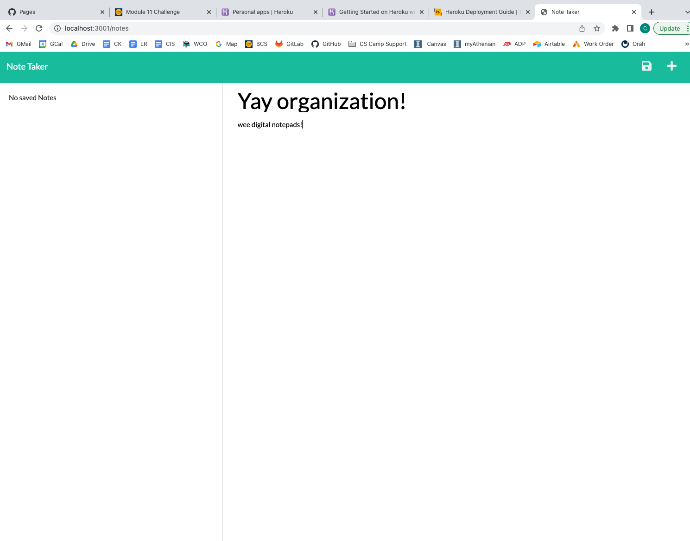

Hi reviewers,

This is the first submission for UCB's Module 11 challenge. 

Thank you for your time!
Cassie Kise

# Application Info:
The following application does the following once the server is started:
 - Routes from the landing page to the notes extension when the button is clicked. 
 - Allows the user to save a note both the title and note info is inputted.
 - The inputted info is then written to the db.json file.
 - Allows the user to delete a both once selected.
 - The decision to delete then removes the passage from the db.json file.

## GitHub links:
- https://github.com/cassandrakise/ucb-assignment-11-note-taker
- https://cassandrakise.github.io/ucb-assignment-11-note-taker/

## Screenshot:

